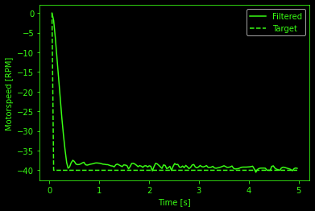

## Micro Mouse V1
In my first project I worked on building a so-called Micromouse. This vehicle can autonomously solve a maze which consists of 180mm x 180mm squares. 
The goal is to solve the maze as fast as possible. However, my goal of the project was to simply create a working Micromouse that can detect walls and avoid them.
 

### The outcome
The outcome of this project can be seen in this small [demo video](https://youtube.com/shorts/Iuyp9veY2lQ?si=Q0pG9aVJq4gSYLD3)
Here i tried to reconstructed the dimension of Micromouse maze using books. Several things can be noted. First of all, the vehicle is able to detect the walls of the maze and successfully perform a left turn.
This is great news! Secondely the vehicle is rather slow and the motors are quite loud. During the video, the micromouse is running at 20 rpm which is around one-third of the max speed so there is still room for improvement.

### Technical details of the Micromouse
A more detailed photo with the mounted components can be seen in this picture:
|  | 
|:--:| 
| A photo of the Micromouse and its mounted parts |

The Micromouse is powered by a 9V Battery. Assuming the motor runs at rated speed this results in a lifetime of about half an hour. All of the controlling is done via an Arduino Nano board.
The two DC Motors are connected to a tiny dual H-bridge motor driver. This motor driver provides the motors with powers, returns the measurement of the encoder sensor.
Using the measurement of the encoders the speed of the motor can be measured and also the direction. Using a PID controller which i programmed in the arduino interface the speed of the motors can be regulated.
Following pictures shows the performance of the PID controller for one motor which is evaluated using a step response to 40 rpm 

|  | 
|:--:| 
| Measured RPM vs set RPM for one of the two motors |

## Second Project
Second

[ascii](figures/ascii_output.txt)

## Neon Clock

<!--  -->

|  | 
|:--:| 
| *Space* |

text again